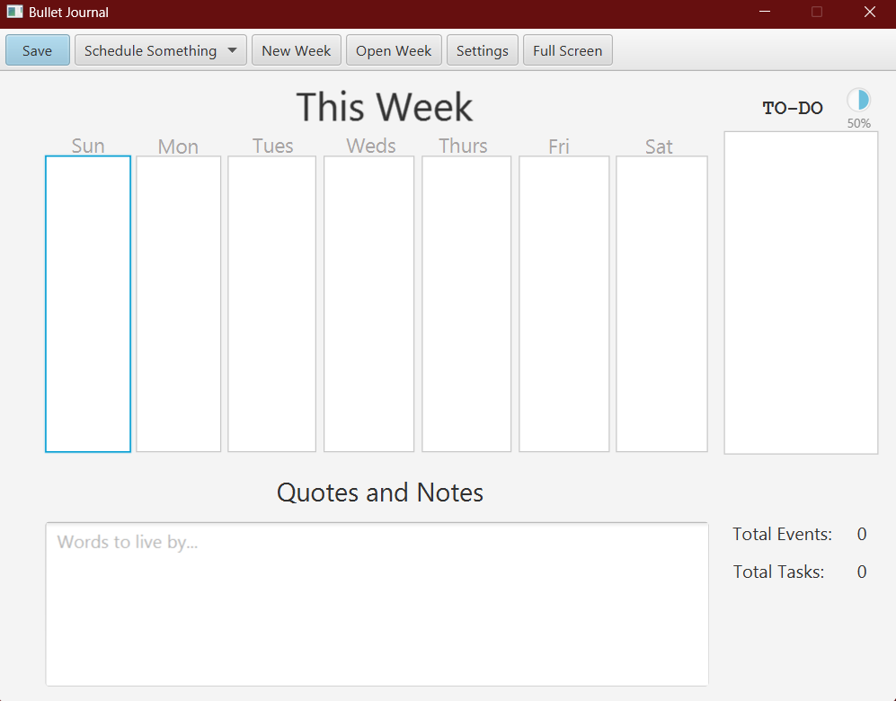

# 3500 PA05 Project Repo

[PA Write Up](https://markefontenot.notion.site/PA-05-8263d28a81a7473d8372c6579abd6481)

# App Store Pitch
Have you ever wanted to see your schedule in a nice and organized way on your computer? Of course, you have!
To introduce this revolutionary idea, our team proudly presents the BulletJournal App.
## Section 1
- Week View
  - In the beginning, you can see plain and clear: nothing short of your week and its days. 
- What a perfect representation of the endless potential of not only you but our app.
- Event and Task Creation
  - But what schedule would be complete without things to do and places to see?
  - We have allowed you to create an Event or a Task from a simple but ingenious dropdown menu
    - A Task lets you plan out a Title and a Description. Simple, but sometimes beauty lies in simplicity.
    - An Event lets you plan out a Title and Description just like a Task, but you also get to pick what time you start 
    how long it lasts for!
- Persistence
  - Having your bullet journal is great, but what if we told you, you can have your journal and save it too!
  - With a simple click of the Save button, you can place your journal wherever you want!
  - And with an equally simple click of the Open button, you can find that journal you saved!
- Commitment Warnings
  - While this is all great, it's important to avoid getting too carried away. We know that self-control is a difficult
  virtue to come by, so we decided to help you out with that. In our Settings button, we let you modify not only the 
  name of the Week, but set some limits on how many events and tasks each day can have.

## Section 2
- Task Queue
  - A journal is only as great as its extent of organization. Imagine if you just had Tasks and Events clustered
  together, with not even a semblance of order. What a nightmare that'd be! Worry not, for we have created a Task queue
  for you to employ! In here, only the Task objects you create will be stored here, and you can decide to mark as 
  complete at will. A great way to keep track of your progress.
- Menu Bar & Shortcuts
  - Buttons are such a thing of the past. We keep them on our screen because they look nice, but why use them?
  Especially when we have such convenient shortcuts for you! Not only have we organized the relevant buttons in a bar
  above the week view, but we have given each an associated command.
  - Ctrl+S = Save
  - Ctrl+O = Open
  - Ctrl+N = New Week
  - Ctrl+E = New Event
  - Ctrl+T = New Task
  - Ctrl+X = Settings
  - Ctrl+Z = Undo (remove last addition)
  - Ctrl+F = Full Screen

## Section 3
- Quotes & Notes
  - After a while, just a week viewer can get a little bland. What better way to spice up your experience than by 
  giving yourself a bit of encouragement? Now with the Quotes & Notes update, you can write down whatever inspirational
  saying from your favorite person. Think that sounds great? It gets better! When you save a Week with Quotes, 
  it persists into your File!
- Progress Bar
  - What if you wanted a tangible and interact-able way to see how well you're doing? Now you can! The Progress Bar (TM)
  shows you how many tasks you have left for each day, as well as how many tasks are left in the whole week.
- Takesie-backsies
  - Let's face it: mistakes happen. We don't like to admit it when they do, but they're an unfortunate fact of life. Or
  so they would have been, until now. You can now simply remove any Event or Task that does not fit your standards, with
  a simple click of a few buttons.

## Section 4
- Links
  - The tech age is a fascinating thing: and the Internet is the landmark invention of this era. Since everything
  nowadays seems to want to get to the Internet as fast as possible, we now support directly adding a URL into your
  task or event description.
- Mind Changes
  - What if you didn't... exactly make a mistake? You didn't, but you're also not super pleased with what you've got.
  Now, you get a super convenient method of managing editing any of your tasks or events. You can now open up any 
  item just by clicking on it, where you'll be presented with the option to delete or edit it. With these options, you
  can literally never go wrong ever again.

## Section 5 (EC, as if it wasn't cool enough)
- Splash Screen
  - Who wants to open their app and immediately be greeted by a wall of icons? Nobody, we hope. With this feature,
  you'll never face that problem again. After opening, you'll see a loading screen, which will prompt you to click 
  a button to continue, serving as a great barrier between this app and the rest of the world.
- Privacy Lock
  - Having a bullet journal is nice and all, but not everyone should be able to see your stuff. Now, with password
  implementation, you can keep your secrets under wraps.

# SOLID Implementation
- Single Responsibility:
  - We have many different Controller classes to represent various states of the app. There are times we have to show
  a Popup, and there are various Popups within that category. For our Model objects, we have ensured that no object
  contains too much information, and various classes contain each other to delegate responsibility.
- Open/Closed:
  - Our code is open for extension by utilizing inheritance to keep certain classes safe from any modification. 
  Other classes are able to extend that class and then use its code for similar functions. 
- Liskov Substitution:
  - In our classes, we often use the List interface, which allows us to be flexible with our creation of new objects.
  We are able to have a List of ScheduledItems or Strings, and it all functions the same. ScheduledItems itself is an
  abstract class is a good example, as its children classes are able to replace it wherever it appears and the
  functionality remains the same.
- Interface Segregation:
  - Our interfaces are not extremely long and each class mostly only need to extend one and all of its methods. However,
  we do have an example of Interface Segregation with Controller and PopupController. One is clearly a child of the
  other, so PopupController extends Controller so that popup classes are able to just implement that interface and not
  all Controller.
- Dependency Inversion:
  - Whenever any class requires the input of another complex object, we ensure that we pass that object in as a 
  parameter instead of initializing it separately. This ensures that our code is not too tightly coupled, and classes
  don't depend on each other too heavily. Errors can be easily traced to a certain class, and it avoids confusion 
  overall.

# Implementing Another Feature
- Categories
  - This feature seemed fascinating and a good way to organize, so we thought of a few ways to implement this. We would 
  definitely use a new field to handle the new information added to every task and event, though
  we'd likely discuss if we ultimately use an enum or a String. Then, we could take the collection of categories created
  and store it in the Week class. This would then be processed when saving with persistence and returned when opening.
  After a category is created and stored in a list, whenever a new Task or Event would be created, the user is given 
  the option to add on a category to it, most likely from a dropdown menu in FXML.